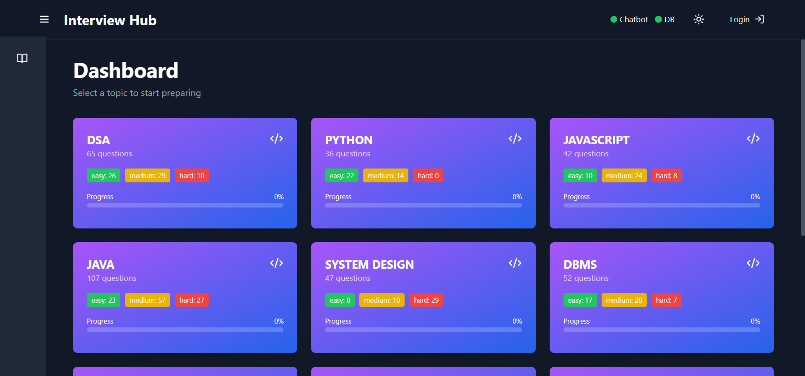
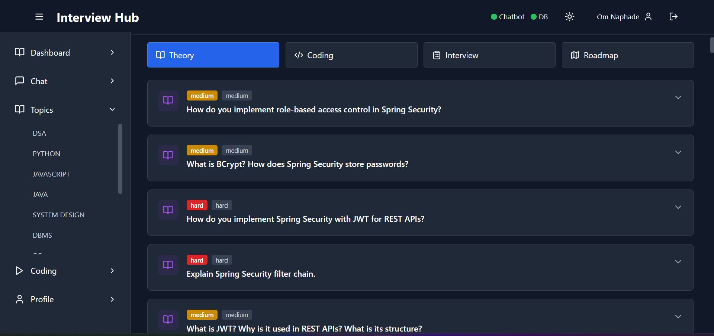
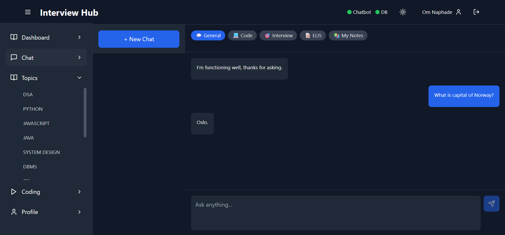
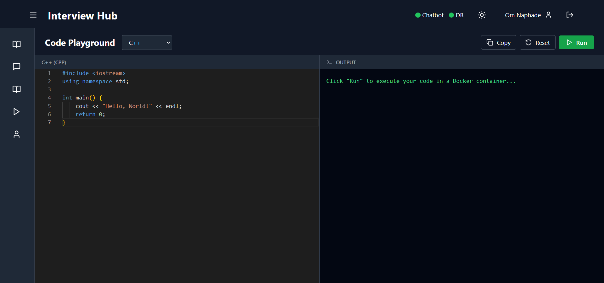
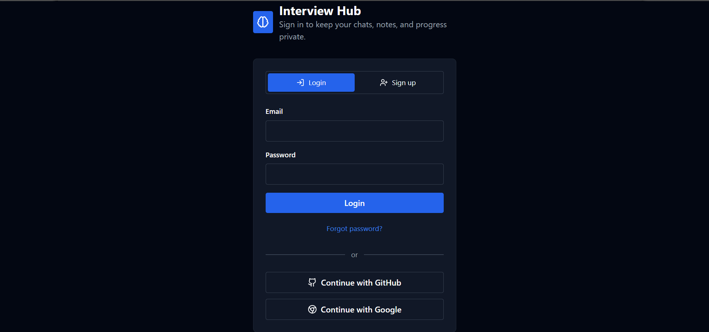
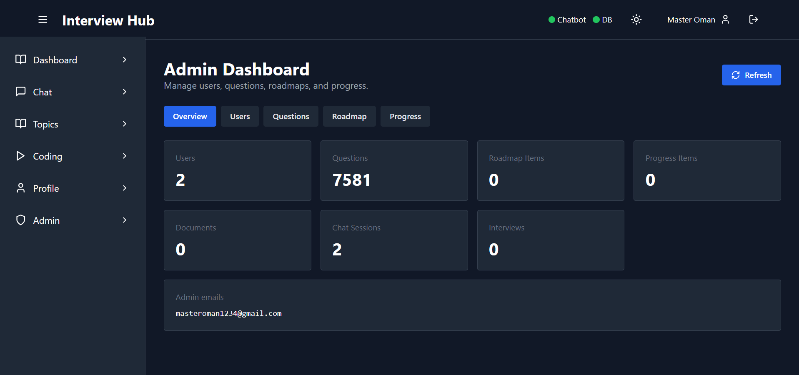

# Interview Hub 🎯
> AI-powered interview preparation platform with semantic search, RAG pipelines, Docker code execution, and specialised chat modes.

[](https://interview-hub-frontend.netlify.app)
<!-- [](https://github.com/OmNaphade/interview-hub/actions) -->
[](LICENSE)

> ⚠️ **Heads up:** The backend runs on Render's free tier — it spins down after inactivity. Questions may take a moment to load on every visit. Please be patient.

> 🚧 **Work in progress:** This project is actively under development. Some features may be incomplete or change without notice.

---

## What It Does

Interview Hub helps engineers prepare for technical interviews using AI — not static question banks. Practice across 12 topics, run code live in the browser, chat with an AI coach, and track your progress over time.

- **4,800+ questions** across 12 topics — DSA, Java, System Design, DevOps, SQL, and more
- **RAG pipeline** — ingest PDFs, DOCX files, and URLs into a searchable knowledge base
- **5 specialised chat modes** — each with its own system prompt and retrieval context
- **Code playground** — run code in 8 languages via isolated Docker containers
- **Mock interview engine** — AI-powered answer scoring via GROQ
- **Progress tracking** — per-topic study tracking, bookmarks, and completion stats
- **Full auth** — email/password, Google OAuth, GitHub OAuth
- **Admin monitoring** — request metrics, endpoint latency, GROQ/container activity, runtime health

---

## Screenshots

### Dashboard


### Topic Questions


### AI Chat


### Code Playground


### Login


### Admin Dashboard


---

## Tech Stack

| Layer | Technology |
|---|---|
| Frontend | React 18, Vite, Tailwind CSS, Zustand, React Router v6 |
| Backend | Node.js, Express.js, Prisma ORM |
| Database | PostgreSQL + pgvector |
| AI — Chat | GROQ Cloud (`llama-3.1-8b-instant`) |
| AI — Embeddings | Ollama (`nomic-embed-text`) |
| Code Execution | Docker (isolated containers per language) |
| Auth | Custom HMAC-SHA256 JWT, HTTP-only cookies |
| Hosting | Netlify · Render · Supabase |

---

## Architecture

```
React (Netlify)
      │  HTTP + SSE
      ▼
Express.js (Render)
      │
      ├── groqService      →  GROQ Cloud (chat, scoring)
      ├── ollamaService    →  Ollama (embeddings only)
      ├── ragService       →  pgvector similarity search
      ├── dockerService    →  Isolated container execution
      └── documentParser  →  PDF · DOCX · URL extraction
            │
            ▼
      PostgreSQL + pgvector (Supabase)
```

**Chat streaming** uses Server-Sent Events (SSE) — no WebSocket library, works over standard HTTP, auto-reconnects on disconnect.

**RAG pipeline:**
```
Question → Embed (Ollama) → pgvector search (top 5 chunks) → GROQ prompt → Grounded answer
```

---

## Topics

| Topic | Topic | Topic |
|---|---|---|
| DSA | Java | System Design |
| DevOps | SQL | DBMS |
| JavaScript | Python | React |
| Node.js | Networking | OS |

Each topic has **Theory**, **Coding**, **Interview**, and **Roadmap** tabs. Questions are tagged by difficulty (Easy / Medium / Hard).

---

## Code Playground

Write and run code in the browser. Each run executes in a sandboxed Docker container — no shared state, no network access, destroyed after execution.

**Supported languages:** Python · JavaScript · Java (8/11/17) · C++ · MySQL · PostgreSQL

**Security per container:**
- `--network none` — zero network access
- `-m 256m` — memory cap (512MB for Java)
- `--cpus 1` — single core
- 30s execution timeout, destroyed immediately after

> The playground requires Docker on the host. On Render's free tier, Docker is unavailable — the app detects this at startup and degrades gracefully. All other features continue normally.

---

## Chat Modes

| Mode | Use Case |
|---|---|
| `general` | Open-ended questions |
| `code` | Debugging, code review, hints |
| `interview` | Practice answers with AI coaching |
| `eli5` | Simple plain-English explanations |
| `rag` | Chat with your uploaded documents |

---

## Getting Started

### Prerequisites

- Node.js 16+
- PostgreSQL 13+ with pgvector extension
- GROQ API key — [groq.com](https://groq.com)
- Ollama installed locally (for document embeddings)
- Docker Desktop (for playground execution)

### Local Setup

```bash
# Clone
git clone https://github.com/OmNaphade/interview-hub.git
cd interview-hub

# Backend
cd server
cp .env.example .env        # fill in DATABASE_URL and GROQ_API_KEY
npm install
npx prisma migrate deploy
node prisma/seed.js         # loads 4,800+ questions — takes a few minutes
npm run dev                 # :5000

# Frontend (new terminal)
cd client
npm install
npm run dev                 # :5173
```

| Service | URL |
|---|---|
| Frontend | http://localhost:5173 |
| Backend | http://localhost:5000 |
| Ollama | http://localhost:11434 |

See [SETUP.md](./SETUP.md) for a detailed walkthrough and [DEPLOYMENT.md](./DEPLOYMENT.md) for production deployment.

---

## Backend Environment Variables

Use `.env.example` as a template. Never commit real secrets.

### Required in production

| Variable | Description |
|---|---|
| DATABASE_URL | PostgreSQL connection string |
| AUTH_SECRET | JWT signing secret (minimum 32 characters) |
| CORS_ORIGINS | Allowed frontend origins (comma-separated) |

### Recommended

| Variable | Description |
|---|---|
| FRONTEND_URL | Canonical frontend URL for redirects |
| ADMIN_EMAILS | Admin allowlist (comma-separated emails) |
| ALLOW_PASSWORD_AUTH | Enable/disable email-password auth (`true`/`false`) |
| ALLOW_PASSWORD_ADMIN_SIGNUP | Allow password-based admin signup (`false` in production) |
| GROQ_API_KEY | GROQ API key |
| GROQ_MODEL | GROQ model name (defaults to `llama-3.1-8b-instant`) |

### Optional

| Variable | Description |
|---|---|
| REDIS_URL | Shared rate-limit store for multi-instance deployments |
| OLLAMA_BASE_URL | Ollama endpoint for embeddings |
| OLLAMA_API_KEY | Optional Ollama auth key |
| EMBED_MODEL | Ollama embedding model |
| DATAFILES_PATH | Datafiles directory path |
| CHUNK_SIZE | RAG chunk size |
| CHUNK_OVERLAP | RAG chunk overlap |
| TOP_K_CHUNKS | RAG retrieval top-k |
| TRUST_PROXY | `true` behind Render/ingress proxies |
| GITHUB_CLIENT_ID / GITHUB_CLIENT_SECRET / GITHUB_CALLBACK_URL | GitHub OAuth setup |
| GOOGLE_CLIENT_ID / GOOGLE_CLIENT_SECRET / GOOGLE_CALLBACK_URL | Google OAuth setup |

> Important: `CHAT_MODEL` is not used by current backend config. Use `GROQ_MODEL` for chat model selection.

---

## Render Deployment Notes

If deployment fails during `prisma migrate deploy` with an error like:

`FATAL: (ENOTFOUND) tenant/user ... not found`

it usually means the `DATABASE_URL` is incorrect for your Supabase tenant or credentials.

Checklist:

1. Copy the exact Prisma connection string from Supabase (same project and region).
2. Ensure host and username/project-ref match the same project.
3. URL-encode password special characters (`@`, `:`, `/`, `?`, `#`, `%`).
4. Re-save `DATABASE_URL` in Render and redeploy.

---

## Troubleshooting (Windows Git)

If `git add -A` fails with:

`error: invalid path 'nul'`

then a Windows-reserved path was created in repo root. Remove it with:

```powershell
Set-Location "d:\PRACTICE\interview-hub"
Remove-Item -LiteralPath "\\?\d:\PRACTICE\interview-hub\nul" -Force -ErrorAction SilentlyContinue
Remove-Item -LiteralPath "\\?\d:\PRACTICE\interview-hub\nul\" -Recurse -Force -ErrorAction SilentlyContinue
git add -A -- .
```

This repository includes `.gitattributes` to stabilize line endings and reduce CRLF/LF warnings.

---

## OAuth Setup (optional)

**Google**
1. Create OAuth 2.0 Client ID in [Google Cloud Console](https://console.cloud.google.com)
2. Authorized redirect URI: `http://localhost:5000/api/auth/google/callback`
3. Add `GOOGLE_CLIENT_ID` and `GOOGLE_CLIENT_SECRET` to `.env`

**GitHub**
1. Create OAuth App in [GitHub Developer Settings](https://github.com/settings/developers)
2. Callback URL: `http://localhost:5000/api/auth/github/callback`
3. Add `GITHUB_CLIENT_ID` and `GITHUB_CLIENT_SECRET` to `.env`

Leave both blank to use email/password auth only.

---

## Project Structure

```
interview-hub/
├── assets/                 # Screenshots for README
├── client/
│   └── src/
│       ├── components/     # chat/, interview/, ui/
│       ├── pages/          # Dashboard, Topic, Chat, Playground, Admin
│       ├── store/          # Zustand: auth, chat, ui
│       ├── services/       # Axios API client
│       └── App.jsx         # Router + protected routes
│
└── server/
    ├── routes/             # auth, chat, questions, interview, documents, playground
    ├── controllers/        # Request handler logic
    ├── services/
    │   ├── groqService.js      # GROQ streaming + scoring
    │   ├── ollamaService.js    # Embeddings only
    │   ├── ragService.js       # Vector search + prompt building
    │   ├── dockerService.js    # Container execution (8 languages)
    │   ├── authService.js      # JWT + password hashing
    │   └── documentParser.js   # PDF/DOCX/URL extraction + chunking
    ├── middleware/         # auth, errorHandler, streamHandler
    └── prisma/             # schema, migrations, seed
```

---

## Design Decisions

**GROQ over Ollama for chat** — Faster cloud inference at 8B scale. Ollama is kept only for embeddings since GROQ doesn't offer an embeddings API.

**Docker containers for code execution** — Every run is fully isolated with memory, CPU, and network restrictions. Database queries spin up a temporary container destroyed after the query completes.

**Custom JWT over Passport.js** — No extra dependencies. HMAC-SHA256 signed tokens stored in HTTP-only cookies for XSS protection.

**SSE over WebSocket** — One-way streaming doesn't need bidirectional sockets. Simpler, no library, auto-reconnects.

**pgvector over a dedicated vector DB** — Similarity search runs directly in PostgreSQL. No Pinecone, no Weaviate, no extra infrastructure or cost.

**Centralised error handling** — All errors flow through a single middleware. Stack traces hidden in production.

---

## Roadmap

- [x] 4,800+ question bank (12 topics)
- [x] RAG ingestion pipeline (PDF, DOCX, URL)
- [x] 5 specialised chat modes
- [x] Docker code playground (8 languages)
- [x] Monaco Editor with syntax highlighting
- [x] SSE streaming responses
- [x] Google + GitHub OAuth
- [x] Mock interview with AI scoring
- [x] Progress tracking + bookmarks
- [x] Admin panel (user + question management)
- [x] CI/CD via GitHub Actions
- [ ] Question categorisation improvements (DSA · Java · System Design)
- [ ] 24/7 stable playground environments
- [ ] Timed mock interview mode
- [ ] User progress dashboard with analytics

---

## Deployment

| Component | Provider |
|---|---|
| Frontend | Netlify (auto-deploy on push) |
| Backend | Render (Node web service — free tier) |
| Database | Supabase (PostgreSQL + pgvector) |
| AI Chat | GROQ (cloud API, no hosting needed) |

See [DEPLOYMENT.md](./DEPLOYMENT.md) for step-by-step instructions.

---

## Author

**Om Naphade** · [LinkedIn](https://linkedin.com/in/omnaphade) · [Portfolio](https://om-naphade.netlify.app) · [GitHub](https://github.com/OmNaphade)
